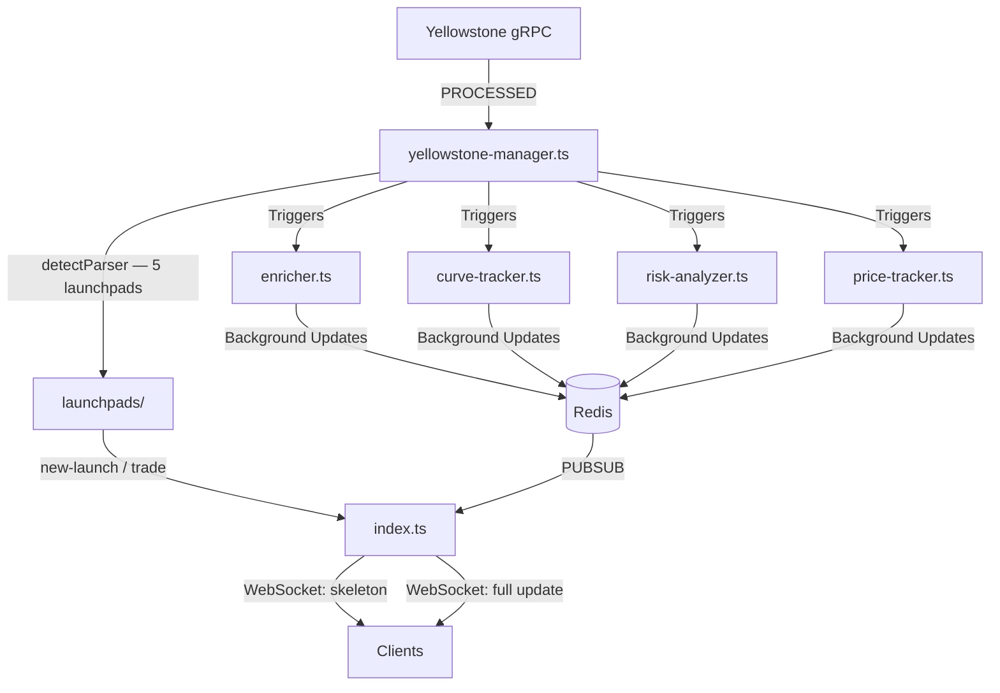

 (Yellowstone Geyser Multi-Launchpad Indexer)

> Ultra-low-latency Solana token detection and enrichment pipeline for multiple launchpads, using Yellowstone gRPC.

Monitors new token launches and trades across **5 Solana launchpads** in real-time. Achieves sub-100ms detection and provides enriched metadata, risk analysis, price tracking, and WebSocket broadcasting.

---

## Supported Launchpads

| Platform | ID | Detection Method |
|---|---|---|
| Pump.fun | `pump` | Program ID in logs |
| Moonshot / Moon.it | `moon` | Program ID in logs |
| Bags.fm (Meteora DBC) | `bags` | Program ID + vanity mint (`*BAGS`) |
| Meteora DBC (generic) | `meteora` | Program ID in logs |
| LetsBonk.fun | `letsbonk` | LaunchLab program + PlatformConfig account |
| Raydium LaunchLab | `launchlab` | LaunchLab program ID |

---

## Features

- **Blazing Fast**: < 100ms detection from on-chain events via Yellowstone gRPC.
- **Multi-Launchpad**: Single stream handles Pump, Moon, Bags, LetsBonk, and LaunchLab.
- **Parallel Enrichment**: Metadata, bonding curve data, and risk analysis populated in 200-800ms.
- **Real-Time Streaming**: WebSocket broadcasts with instant snapshots on room join.
- **Price Tracking**: Per-trade price ticks, rolling price change events (1m to 24h), and chart history.
- **Trending**: Top 50 tokens by SOL volume across 4 time windows (1m, 5m, 30m, 1h), updated every 30s.
- **Sniper Detection**: Any buy within the first 20s of launch is flagged as a sniper.
- **Comprehensive API**: REST endpoints for tokens, price history, and stats.

---

## Architecture



*For more technical details, see [DEVELOPMENT.md](DEVELOPMENT.md).*

---

## WebSocket Rooms

| Room | Event | Description |
|------|-------|-------------|
| `new` | `message` / `update` | All new launches + enrichment updates |
| `graduating` | `message` | Tokens at ≥ 80% bonding curve |
| `graduated` | `message` | Tokens migrated to Raydium |
| `token:{mint}` | `message` / `trade` | Live updates + trades for a specific token |
| `chart:{mint}` | `message` | Price ticks only (optimized for charts) |
| `trending` | `message` | Top 50 tokens by SOL volume across 4 windows |

Joining a room immediately emits a `snapshot` event with current state — no need to wait for the next broadcast cycle.

### Frontend Connection

```js
import { io } from "socket.io-client";
const socket = io("http://localhost:3000");

// Join rooms
socket.emit("join", "new");               // all new launches
socket.emit("join", "graduating");        // tokens about to graduate
socket.emit("join", "graduated");         // migrated tokens
socket.emit("join", `token:${mint}`);     // specific token (full data + trades)
socket.emit("join", `chart:${mint}`);     // specific token (price ticks only)
socket.emit("join", "trending");          // top 50 by volume, 4 windows

// Listen
socket.on("snapshot", ({ room, data }) => { /* initial state on join */ });
socket.on("message",  (payload) => { /* full/chart/trending data */ });
socket.on("update",   (payload) => { /* enrichment updates */ });
socket.on("trade",    (data)    => { /* { mint, signature, type, solAmount } */ });
```

### Trending Payload

```js
// trending message.data shape:
{
  "1m":  [ ...top50 ],  // by SOL volume in last 1 minute
  "5m":  [ ...top50 ],  // by SOL volume in last 5 minutes
  "30m": [ ...top50 ],  // by SOL volume in last 30 minutes
  "1h":  [ ...top50 ],  // by SOL volume in last 1 hour
}
```

---

## REST Endpoints

| Method | Path | Description |
|--------|------|-------------|
| `GET` | `/new` | Latest 50 tokens (full payload) |
| `GET` | `/api/token/:mint` | Single token full payload |
| `GET` | `/api/token/:mint/history` | Price history (`?limit=200`) |
| `GET` | `/api/stats` | Stream stats (token count, uptime) |
| `GET` | `/` | HTML dashboard (latest 20 tokens, auto-refreshes) |

---

## Prerequisites

- **Node.js**: 20+ (using `nvm` recommended)
- **Redis**: 7+ installed and running
- **Solana RPC**: A high-performance RPC (e.g., Helius, Quicknode)
- **Yellowstone Geyser**: A Geyser gRPC endpoint (e.g., Chainstack, Triton)

---

## Installation

```bash
git clone https://github.com/wave745/multi-launchpad-data
cd multi-launchpad-data
npm install
```

### Environment Setup

Create a `.env` file in the root:

```env
REDIS_URL=redis://localhost:6379
SOLANA_RPC=https://your-rpc-endpoint
CHAINSTACK_GEYSER_URL=https://yellowstone-solana-mainnet.core.chainstack.com
CHAINSTACK_GEYSER_TOKEN=your-auth-token
```

### Running

```bash
npm start
# → API: http://localhost:3000
```

---

## Deployment

### Option 1: PM2 (Recommended — Quick & Simple)

```bash
sudo npm install -g pm2
pm2 start "npm start" --name sol-indexer
pm2 startup && pm2 save
```

Or use an `ecosystem.config.js`:

```js
module.exports = {
  apps: [{
    name: "sol-indexer",
    script: "src/index.ts",
    interpreter: "tsx",
    instances: 1,
    autorestart: true,
    max_memory_restart: "2G",
    env_production: { NODE_ENV: "production" }
  }]
};
```

Monitoring:

```bash
pm2 status
pm2 logs sol-indexer
pm2 monit
```

### Option 2: Docker

**`Dockerfile`**:

```dockerfile
FROM node:20-alpine
WORKDIR /app
COPY package*.json ./
RUN npm install
COPY . .
RUN npm install -g tsx
EXPOSE 3000
CMD ["tsx", "src/index.ts"]
```

**`docker-compose.yml`**:

```yaml
version: '3.8'
services:
  indexer:
    build: .
    restart: always
    ports:
      - "3000:3000"
    environment:
      - NODE_ENV=production
      - REDIS_URL=redis://redis:6379
      - SOLANA_RPC=${SOLANA_RPC}
      - CHAINSTACK_GEYSER_URL=${CHAINSTACK_GEYSER_URL}
      - CHAINSTACK_GEYSER_TOKEN=${CHAINSTACK_GEYSER_TOKEN}
    depends_on:
      - redis
  redis:
    image: redis:7-alpine
    restart: always
    volumes:
      - redis-data:/data
volumes:
  redis-data:
```

```bash
docker compose up -d --build
```

---

## Performance Benchmarks

| Metric | Target |
|--------|--------|
| Detection Latency | < 100ms |
| Enrichment Time | < 800ms |
| Memory Usage | ~10 MB / 400 tokens |
| Throughput | 3000+ txs/min |

---

## DEX Analysis (Python Component)

The repository includes a secondary **`dex_checker.py`** component designed for deep inspection of token listings on DexScreener.

### Features
- **Paid Status Verification**: Checks if a token has active paid marketing (Token Profile, Community Takeover, or Ads) via the DexScreener Orders API.
- **Boost Tracking**: Monitors active and total boost counts to identify high-interest tokens.
- **Media Extraction**: Automatically fetches banner, header, and profile images for verified tokens.
- **Golden Status**: Identifies "Golden" tokens (those with ≥ 500 active boosts).
- **Production-Ready**:
  - **In-Memory Caching**: Intelligent TTL (1hr for paid status, 5min for dynamic boosts).
  - **Rate Limit Handling**: Built-in exponential backoff and request throttling.
  - **Thread-Safe**: Uses locking mechanisms for safe concurrent cache access.

### Usage
```python
from dex_checker import DexChecker

checker = DexChecker()
info = checker.check_dex_info("solana", "TOKEN_ADDRESS")
print(info)
# Returns: {'dex_paid': True, 'active_boosts': 520, 'banner_url': '...', 'show_golden': True}
```

---
