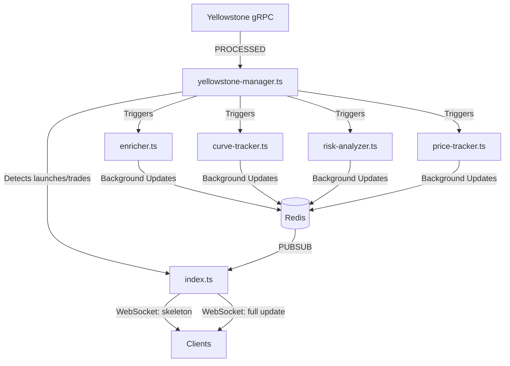

# sol-indexer (Yellowstone Geyser Multi-Launchpad Indexer)

> Ultra-low-latency Solana token detection and enrichment pipeline for Pump.fun, using Yellowstone gRPC.

This indexer provides real-time monitoring of new token launches and trades on Solana launchpads, starting with Pump.fun. It achieves sub-100ms detection and provides enriched metadata, risk analysis, and price tracking.

---

## 🚀 Features

- **Blazing Fast**: < 100ms detection from on-chain events via Yellowstone gRPC.
- **Parallel Enrichment**: Metadata, bonding curve data, and risk analysis populated in 200-800ms.
- **Real-Time Streaming**: WebSocket broadcasts for skeleton payloads (instant) and full updates (enriched).
- **Price Tracking**: Per-trade price ticks and rolling price change events (1m to 24h).
- **Comprehensive API**: REST endpoints for latest tokens and historical price data.
- **Robust Architecture**: Uses Redis PUBSUB for decoupled, efficient broadcasting.

---

## 🏗️ Architecture



*For more technical details, see [DEVELOPMENT.md](DEVELOPMENT.md).*

---

## 📦 Prerequisites

- **Node.js**: 20+ (using `nvm` recommended)
- **Redis**: 7+ installed and running
- **Solana RPC**: A high-performance RPC (e.g., Helius, Quicknode)
- **Yellowstone Geyser**: A Geyser gRPC endpoint (e.g., Chainstack, Triton)

---

## 🛠️ Installation

```bash
git clone https://github.com/your-org/sol-indexer.git
cd sol-indexer
npm install
```

### Environment Setup
Create a `.env` file in the root:
```env
REDIS_URL=redis://localhost:6379
SOLANA_RPC=https://your-rpc-endpoint
YELLOWSTONE_ENDPOINT=https://your-yellowstone-grpc:443
YELLOWSTONE_TOKEN=your-auth-token
PORT=3000
```

---

## 🚢 Deployment Guide

This section explains how to keep the indexer running 24/7 on a production server.

### Option 1: PM2 (Recommended - Quick & Simple)

PM2 is a Node.js process manager. It keeps the app running forever, auto-restarts on crash, and survives server reboots.

1. **Install PM2 globally**
   ```bash
   sudo npm install -g pm2
   ```

2. **Start the indexer**
   Directly using `tsx`:
   ```bash
   pm2 start "npm start" --name sol-indexer
   ```
   *Or use an `ecosystem.config.js` for more control:*
   ```js
   module.exports = {
     apps: [{
       name: "sol-indexer",
       script: "src/index.ts",
       interpreter: "tsx",
       instances: 1,
       autorestart: true,
       max_memory_restart: "2G",
       env_production: {
         NODE_ENV: "production"
       }
     }]
   };
   ```

3. **Persistence**
   ```bash
   pm2 startup
   # Run the command generated by pm2 startup
   pm2 save
   ```

4. **Monitoring**
   ```bash
   pm2 status
   pm2 logs sol-indexer
   pm2 monit
   ```

### Option 2: Docker (Recommended for Scale)

Docker makes the app portable and easy to manage alongside Redis.

1. **Create `Dockerfile`**
   ```dockerfile
   FROM node:20-alpine
   WORKDIR /app
   COPY package*.json ./
   RUN npm install
   COPY . .
   RUN npm install -g tsx
   EXPOSE 3000
   CMD ["tsx", "src/index.ts"]
   ```

2. **Create `docker-compose.yml`**
   ```yaml
   version: '3.8'
   services:
     indexer:
       build: .
       restart: always
       ports:
         - "3000:3000"
       environment:
         - NODE_ENV=production
         - REDIS_URL=redis://redis:6379
         - SOLANA_RPC=${SOLANA_RPC}
         - YELLOWSTONE_ENDPOINT=${YELLOWSTONE_ENDPOINT}
         - YELLOWSTONE_TOKEN=${YELLOWSTONE_TOKEN}
       depends_on:
         - redis
     redis:
       image: redis:7-alpine
       restart: always
       volumes:
         - redis-data:/data
   volumes:
     redis-data:
   ```

3. **Launch**
   ```bash
   docker compose up -d --build
   ```

---

## 📈 Performance Benchmarks

| Metric | Target |
|--------|-------|
| Detection Latency | < 100ms |
| Enrichment Time | < 800ms |
| Memory Usage | ~10 MB / 400 tokens |
| Throughput | 3000+ txs/min |

---

## 🛡️ License
ISC License. See `package.json`.
